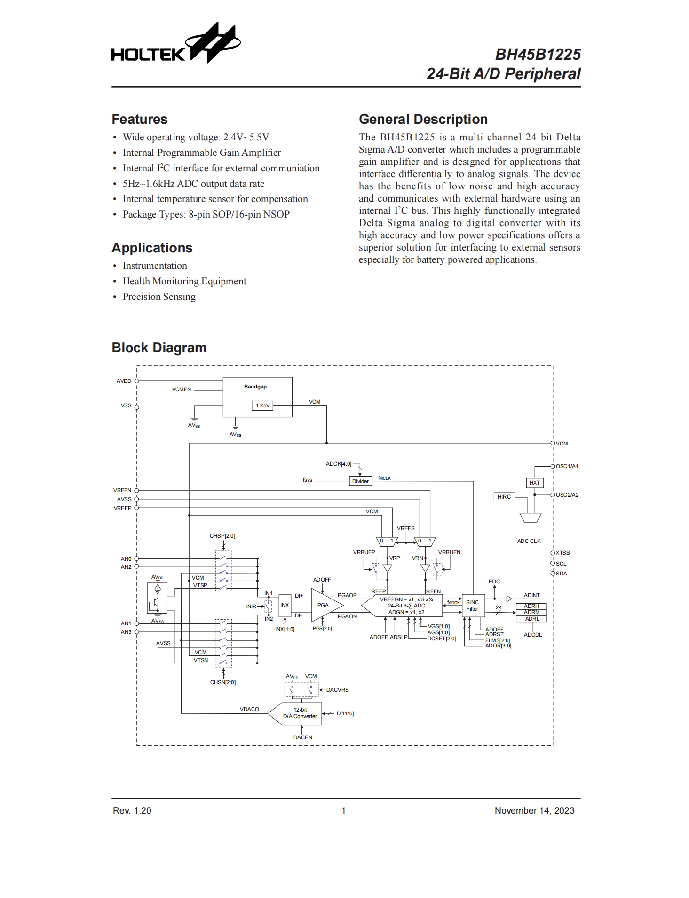

[简体中文](README_cn.md)

# BH45B1225 Driver

BH45B1225 is a high-performance 24-bit Delta-Sigma ADC that integrates a programmable gain amplifier (PGA, 1\~128x), 12-bit DAC, temperature sensor, and multiple input channels (4 single-ended / 2 differential). It supports an internal 1.25V reference voltage, configurable via I2C interface, with adjustable data rate (5\~1600Hz), suitable for precision measurement, sensor acquisition, industrial control and other applications.



## Porting

Implement 3 functions:

```c
// Write - data format: [register address][data...]
int bh45b1225_i2c_write(uint8_t dev_addr, const uint8_t *data, uint16_t len) {
    return HAL_I2C_Master_Transmit(&hi2c1, dev_addr, data, len, 1000);
}

// Read
int bh45b1225_i2c_read(uint8_t dev_addr, uint8_t reg, uint8_t *data, uint16_t len) {
    if (HAL_I2C_Master_Transmit(&hi2c1, dev_addr, &reg, 1, 1000) != HAL_OK) return -1;
    return HAL_I2C_Master_Receive(&hi2c1, dev_addr, data, len, 1000);
}

// Delay
void bh45b1225_delay_ms(uint32_t ms) {
    HAL_Delay(ms);
}
```

## Usage

```c
bh45b1225_dev_t sensor;

// Initialize (8-bit address, e.g. 0xD0)
bh45b1225_init(&sensor, 0xD0, bh45b1225_i2c_write, bh45b1225_i2c_read, bh45b1225_delay_ms);

// Configure differential input (AN0-AN1)
bh45b1225_set_input_channel(&sensor, BH45B1225_IN1_AN0, BH45B1225_IN2_AN1);
bh45b1225_reset_adc_filter(&sensor);
bh45b1225_start_conversion(&sensor);

// Read
while (1) {
    bool complete;
    if (bh45b1225_check_eoc(&sensor, &complete) == 0 && complete) {
        int32_t raw;
        bh45b1225_read_data(&sensor, &raw);
        bh45b1225_clear_eoc(&sensor);

        float voltage = bh45b1225_code_to_voltage(raw, 1.241f, 1.0f);
    }
}
```

## API

### Basic Functions
| Function | Description |
|----------|-------------|
| `bh45b1225_init()` | Initialize device |
| `bh45b1225_set_vcm()` | Enable/disable VCM |
| `bh45b1225_set_vref_source()` | Set ADC reference voltage source (internal/external) |

### Input & Gain Configuration
| Function | Description |
|----------|-------------|
| `bh45b1225_set_input_channel()` | Configure input channels (IN1/IN2) |
| `bh45b1225_set_inx_polarity()` | Set input polarity via INX bits |
| `bh45b1225_set_pga_gain()` | Set PGA total gain (1~128) |

### Clock & Oscillator
| Function | Description |
|----------|-------------|
| `bh45b1225_enable_hirc()` | Enable HIRC internal oscillator |
| `bh45b1225_check_hirc_stable()` | Check if HIRC oscillator is stable |

### ADC Configuration
| Function | Description |
|----------|-------------|
| `bh45b1225_set_data_rate()` | Set ADC output data rate (5~1600Hz) |
| `bh45b1225_set_adc_mode()` | Set ADC work mode (normal/sleep/poweroff) |
| `bh45b1225_set_vref_buffer()` | Enable/disable reference voltage buffers |

### ADC Operations
| Function | Description |
|----------|-------------|
| `bh45b1225_reset_adc_filter()` | Reset ADC filter |
| `bh45b1225_set_data_latch()` | Enable/disable data latch |
| `bh45b1225_start_conversion()` | Start ADC conversion |
| `bh45b1225_check_eoc()` | Check if conversion is complete |
| `bh45b1225_read_data()` | Read 24-bit ADC result |
| `bh45b1225_clear_eoc()` | Clear EOC flag |

### DAC Operations
| Function | Description |
|----------|-------------|
| `bh45b1225_set_dac_enable()` | Enable/disable DAC |
| `bh45b1225_set_dac_vref()` | Set DAC reference voltage source (AVDD/VCM) |
| `bh45b1225_set_dac_output()` | Set DAC output value (12-bit, 0-4095) |

### Utility Functions
| Function | Description |
|----------|-------------|
| `bh45b1225_code_to_voltage()` | Convert ADC code to voltage |

### Advanced Configuration (Use with caution)
| Function | Description |
|----------|-------------|
| `bh45b1225_set_pwrc_opt()` | Set PWRC optimization bits |
| `bh45b1225_set_adcte()` | Set ADC test configuration register |
| `bh45b1225_set_filter_mode()` | Set ADC filter mode (FLMS) |
| `bh45b1225_set_osr()` | Set ADC oversampling rate (OSR) |
| `bh45b1225_set_clock_div()` | Set ADC clock division |

## Understanding Common-Mode Voltage and Input Configuration

### 1 Definition of Common-Mode Voltage

The BH45B1225 is a differential input ADC. Its core measurement object is the voltage difference between the positive input pin (INP) and the negative input pin (INN), calculated as follows:

$$V_{\text{diff}} = V_{\text{INP}} - V_{\text{INN}}$$

In a differential measurement system, the average of the absolute voltages of the two input pins relative to the ADC ground is defined as the **common-mode voltage**, expressed mathematically as:

$$V_{\text{CM}} = \frac{V_{\text{INP}} + V_{\text{INN}}}{2}$$

> **Note**: The "$V_{\text{CM}}$" mentioned here refers to the physical concept of common-mode voltage and must be strictly distinguished from the chip's VCM pin (internal reference voltage output pin).

### 2 Common-Mode Voltage Limits of BH45B1225

The common-mode voltage input range of the BH45B1225 is determined by the analog supply voltage (AVDD). The device datasheet explicitly specifies its effective range as:

$$\boldsymbol{0.4\,\text{V} \le V_{\text{CM}} \le (AVDD - 0.95)\,\text{V}}$$

The common-mode voltage ranges corresponding to different AVDD conditions are shown in Table 1.

**Table 1: Common-Mode Voltage Range for Different AVDD Values**

| AVDD (V) | Common-Mode Voltage Range (V) |
|----------|-------------------------------|
| 2.5      | 0.4 ~ 1.55                    |
| 3.3      | 0.4 ~ 2.35                    |

When the common-mode voltage exceeds the specified range, the ADC conversion accuracy will significantly decrease. If it long-term or severely exceeds the input absolute maximum ratings, there may be risks to device reliability or even permanent failure.

To ensure the common-mode voltage stays within the valid range, the chip has a built-in 1.25V bandgap reference that outputs a stable voltage through the VCM pin. The VCM pin is generated by the chip's internal bandgap reference and remains relatively stable within the AVDD operating range specified in the datasheet. It is weakly correlated with AVDD variations and can serve as an intermediate reference point for differential measurements. In practical applications, **it is recommended to prioritize using the VCM pin as a reference rather than directly connecting to ground**.

### 3 Single-Ended Measurement Configuration

#### 3.1 Hardware Connection

In single-ended measurement mode, hardware connections must follow these specifications:

1. Connect the measured analog signal to the positive input pin INP (any channel from AN0~AN3 can be selected; this document uses AN1 as an example)
2. Connect the negative input pin INN directly to the chip's VCM pin
3. Connect the signal source ground to the chip's VCM pin. The signal source should reference the VCM pin and should not form a DC reference relationship directly with ADC ground

#### 3.2 Working Principle

In single-ended measurement, the actual measured value of the ADC is the difference between the measured signal and the VCM pin voltage:

$$V_{\text{measured}} = V_{\text{AN1}} - V_{\text{VCM}}$$

Since the VCM pin voltage (typical value 1.25V, ±5% tolerance) is in the middle of the ADC's common-mode voltage effective range, it ensures that the absolute voltages of both INP and INN pins meet the device input requirements.

#### 3.3 Verification Method

Use a multimeter to verify the common-mode voltage with the following steps:

1. Measure the voltage between AN1 and the VCM pin; this value should be consistent with the signal source output voltage
2. Measure the AN1-to-ground voltage $V_{\text{AN1-GND}}$ and the VCM-to-ground voltage $V_{\text{VCM-GND}}$ separately
3. Calculate the actual common-mode voltage using the formula $V_{\text{CM}} = \frac{V_{\text{AN1-GND}} + V_{\text{VCM-GND}}}{2}$
4. Verify that the calculated value complies with the range specified in Table 1

> **Common Error Analysis**: In the case of INN connected to ground and INP as a single-ended signal, the common-mode voltage is half of the signal voltage. When the measured signal voltage is low, the common-mode voltage easily falls below the 0.4V lower threshold, causing ADC conversion data distortion or instability.

### 4 Differential Measurement Configuration

#### 4.1 Hardware Connection

In differential measurement mode, hardware connection specifications are as follows:

1. Connect the signal source positive terminal to the INP pin (this document uses AN1 as an example)
2. Connect the signal source negative terminal to the INN pin (this document uses AN2 as an example)
3. If the common-mode voltage exceeds the effective range, you can connect the signal source ground to the VCM pin through a 1kΩ~100kΩ resistor (value determined by signal source impedance) to achieve common-mode level shifting

#### 4.2 Working Principle

In differential measurement mode, the ADC output value is the voltage difference between the two input pins:

$$V_{\text{diff}} = V_{\text{AN1}} - V_{\text{AN2}}$$

**Key Principle**: In differential measurement, besides ensuring the differential voltage is within range, you must also ensure that the common-mode voltage of both input pins meets the 0.4V ~ (AVDD-0.95)V range requirement.

#### 4.3 Verification Method

1. Use a multimeter to separately measure the AN1-to-ground voltage $V_{\text{AN1-GND}}$, the AN2-to-ground voltage $V_{\text{AN2-GND}}$, and the AN1-to-AN2 differential voltage
2. Calculate the actual common-mode voltage: $V_{\text{CM}} = \frac{V_{\text{AN1-GND}} + V_{\text{AN2-GND}}}{2}$
3. If the common-mode voltage is out of range, you need to perform level shifting adjustment through external resistors

> **Important Note**: Even if the differential voltage waveform appears normal when observed with an oscilloscope, if the common-mode voltage exceeds the device's allowable range, the ADC will still output incorrect data.

### 5 Practical Analysis of Differential Measurement with Different Grounding Methods

Test conditions: AVDD = 3.3V, common-mode voltage effective range 0.4V ~ 2.35V; signal source output differential voltage 1V; INP=AN1, INN=AN2.

#### 5.1 Configuration 1: Floating Ground (No Connection Between Signal Ground and Chip Ground)

**Phenomenon**: ADC output data fluctuates violently with no stable effective values.

**Principle Analysis**: When the signal ground is floating, the common-mode voltage is in an undefined state. External electromagnetic interference easily couples into the input pins, causing the absolute voltages of AN1 and AN2 pins to drift randomly. Although the differential voltage theoretically is 1V, the ADC internal circuitry cannot lock onto an effective differential value, ultimately outputting noise data.

#### 5.2 Configuration 2: Signal Ground Connected to Chip Ground (GND)

**Phenomenon**: Can stably measure positive differential voltages, but cannot measure negative differential voltages.

**Data Analysis**: Test data under different signal source settings are shown in Table 2.

**Table 2: Test Data with Signal Ground Connected to GND**

| Signal Source Setting | Signal+ to Ground Voltage (V) | Signal- to Ground Voltage (V) | Differential Voltage (V) | Common-Mode Voltage (V) | Measurement Result |
|------------------------|-------------------------------|-------------------------------|--------------------------|--------------------------|---------------------|
| +1.0V                  | 1.0                           | 0                             | 1                        | 0.5                      | Normal              |
| +0.2V                  | 0.2                           | 0                             | 0.2                      | 0.1                      | Out of Range        |
| -1.0V                  | -1.0                          | 0                             | -1                       | -0.5                     | Out of Range        |

**Problem Analysis**: When measuring negative differential voltages, the signal+ pin voltage becomes negative, exceeding the ADC input voltage range (although the device allows a certain range of input swing, provided that the absolute voltages of each input pin and the common-mode voltage simultaneously meet the limit conditions), leading to conversion failure.

#### 5.3 Configuration 3: Signal Ground Connected to Chip VCM Pin

**Phenomenon**: Both positive and negative differential voltages can be measured with high precision.

**Prerequisites**: The VCM pin outputs a stable voltage with a typical value of 1.25V (±5% tolerance). This voltage remains constant relative to the chip ground. The external signal source ground is connected directly to the VCM pin.

**Data Analysis**: Test data under different signal source settings are shown in Table 3.

**Table 3: Test Data with Signal Ground Connected to VCM Pin**

| Signal Source Setting | Signal- to Ground Voltage (V) | Signal+ to Ground Voltage (V) | Differential Voltage (V) | Common-Mode Voltage (V) | Measurement Result |
|------------------------|-------------------------------|-------------------------------|--------------------------|--------------------------|---------------------|
| +1.0V                  | 1.25                          | 2.25                          | 1                        | 1.75                     | Normal              |
| -1.0V                  | 1.25                          | 0.25                          | -1                       | 0.75                     | Normal              |

**Advantage Analysis**: The measured signal fluctuates around the VCM pin voltage (1.25V). Whether inputting positive or negative differential voltages, the absolute voltages of signal+ and signal- pins are both within the ADC's allowable input range, achieving true bipolar measurement capability.

### 6 Summary

The input characteristics of a differential ADC are jointly determined by the absolute voltage range of individual pins and the differential voltage range between pins. A comparison of measurement capabilities for different reference methods is shown in Table 4.

**Table 4: Comparison of Measurement Capabilities for Different Reference Methods**

| Reference Method       | Measurement Capability       | Technical Description                                                                 |
|------------------------|------------------------------|---------------------------------------------------------------------------------------|
| Ground reference (Configuration 2) | Can only measure positive differential voltages | When measuring negative voltages, the signal+ pin voltage is below 0V, exceeding the ADC input range |
| VCM reference (Configuration 3)   | Can measure positive and negative differential voltages | Signal fluctuates around the VCM pin voltage, always meeting common-mode voltage range requirements |

**Application Recommendation**: For scenarios requiring bipolar voltage measurement such as bridge sensors and audio signals, the VCM pin must be used as the reference ground to ensure measurement accuracy and stability.


