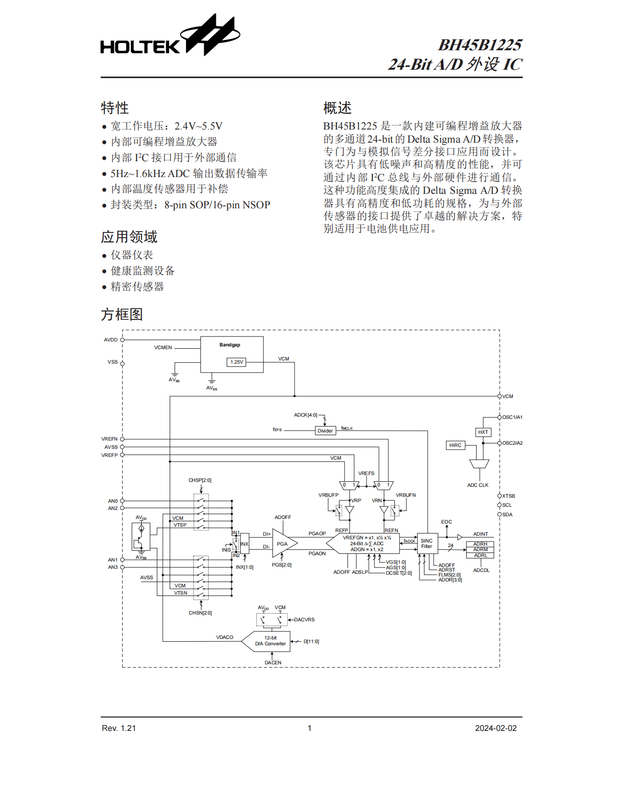

[English](README_en.md)

# BH45B1225 驱动

BH45B1225 是一款高性价比的 24 位 Delta-Sigma ADC，集成可编程增益放大器（PGA，1\~128 倍）、12 位 DAC、温度传感器和多路输入通道（4 路单端 / 2 路差分）。支持内部 1.25V 基准电压，通过 I2C 接口配置，数据速率可调（5\~1600Hz），适用于精密测量、传感器采集、工业控制等场景。



## 移植

实现 3 个函数：

```c
// 写 - data 格式: [寄存器地址][数据...]
int bh45b1225_i2c_write(uint8_t dev_addr, const uint8_t *data, uint16_t len) {
    return HAL_I2C_Master_Transmit(&hi2c1, dev_addr, data, len, 1000);
}

// 读
int bh45b1225_i2c_read(uint8_t dev_addr, uint8_t reg, uint8_t *data, uint16_t len) {
    if (HAL_I2C_Master_Transmit(&hi2c1, dev_addr, &reg, 1, 1000) != HAL_OK) return -1;
    return HAL_I2C_Master_Receive(&hi2c1, dev_addr, data, len, 1000);
}

// 延时
void bh45b1225_delay_ms(uint32_t ms) {
    HAL_Delay(ms);
}
```

## 使用

```c
bh45b1225_dev_t sensor;

// 初始化（8位地址，如 0xD0）
bh45b1225_init(&sensor, 0xD0, bh45b1225_i2c_write, bh45b1225_i2c_read, bh45b1225_delay_ms);

// 配置差分输入 (AN0-AN1)
bh45b1225_set_input_channel(&sensor, BH45B1225_IN1_AN0, BH45B1225_IN2_AN1);
bh45b1225_reset_adc_filter(&sensor);
bh45b1225_start_conversion(&sensor);

// 读取
while (1) {
    bool complete;
    if (bh45b1225_check_eoc(&sensor, &complete) == 0 && complete) {
        int32_t raw;
        bh45b1225_read_data(&sensor, &raw);
        bh45b1225_clear_eoc(&sensor);

        float voltage = bh45b1225_code_to_voltage(raw, 1.241f, 1.0f);
    }
}
```

## API

### 基础函数
| 函数 | 功能 |
|------|------|
| `bh45b1225_init()` | 初始化设备 |
| `bh45b1225_set_vcm()` | 使能/除能 VCM |
| `bh45b1225_set_vref_source()` | 设置 ADC 参考电压源 (内部/外部) |

### 输入与增益配置
| 函数 | 功能 |
|------|------|
| `bh45b1225_set_input_channel()` | 配置输入通道 (IN1/IN2) |
| `bh45b1225_set_inx_polarity()` | 通过 INX 位交换输入极性 |
| `bh45b1225_set_pga_gain()` | 设置 PGA 总增益 (1~128) |

### 时钟与振荡器
| 函数 | 功能 |
|------|------|
| `bh45b1225_enable_hirc()` | 使能 HIRC 内部振荡器 |
| `bh45b1225_check_hirc_stable()` | 检查 HIRC 振荡器是否稳定 |

### ADC 配置
| 函数 | 功能 |
|------|------|
| `bh45b1225_set_data_rate()` | 设置 ADC 输出数据速率 (5~1600Hz) |
| `bh45b1225_set_adc_mode()` | 设置 ADC 工作模式 (正常/休眠/掉电) |
| `bh45b1225_set_vref_buffer()` | 使能/除能参考电压缓存 |

### ADC 操作
| 函数 | 功能 |
|------|------|
| `bh45b1225_reset_adc_filter()` | 复位 ADC 滤波器 |
| `bh45b1225_set_data_latch()` | 使能/除能数据锁存 |
| `bh45b1225_start_conversion()` | 启动 ADC 转换 |
| `bh45b1225_check_eoc()` | 检查转换是否完成 |
| `bh45b1225_read_data()` | 读取 24 位 ADC 结果 |
| `bh45b1225_clear_eoc()` | 清除 EOC 标志 |

### DAC 操作
| 函数 | 功能 |
|------|------|
| `bh45b1225_set_dac_enable()` | 使能/除能 DAC |
| `bh45b1225_set_dac_vref()` | 设置 DAC 参考电压源 (AVDD/VCM) |
| `bh45b1225_set_dac_output()` | 设置 DAC 输出值 (12 位, 0-4095) |

### 工具函数
| 函数 | 功能 |
|------|------|
| `bh45b1225_code_to_voltage()` | 将 ADC 码转换为电压 |

### 高级配置（谨慎使用）
| 函数 | 功能 |
|------|------|
| `bh45b1225_set_pwrc_opt()` | 设置 PWRC 优化位 |
| `bh45b1225_set_adcte()` | 设置 ADC 测试配置寄存器 |
| `bh45b1225_set_filter_mode()` | 设置 ADC 滤波器模式 (FLMS) |
| `bh45b1225_set_osr()` | 设置 ADC 过采样率 (OSR) |
| `bh45b1225_set_clock_div()` | 设置 ADC 时钟分频 |

# 理解共模电压与输入配置
## 1 共模电压的定义
BH45B1225 为差分输入型 ADC，其核心测量对象为正输入引脚（INP）与负输入引脚（INN）之间的电压差值，计算公式如下：
$$V_{\text{diff}} = V_{\text{INP}} - V_{\text{INN}}$$

在差分测量体系中，两个输入引脚相对于 ADC 地的绝对电压平均值，被定义为**共模电压**，其数学表达式为：
$$V_{\text{CM}} = \frac{V_{\text{INP}} + V_{\text{INN}}}{2}$$

> **注意事项**：本文所提及的“$V_{\text{CM}}$”为共模电压的物理概念，需与芯片的 VCM 引脚（内部基准电压输出引脚）严格区分。

## 2 BH45B1225 共模电压限制
BH45B1225 的共模电压输入范围由模拟电源电压（AVDD）决定，器件手册明确规定其有效范围为：
$$\boldsymbol{0.4\,\text{V} \le V_{\text{CM}} \le (AVDD - 0.95)\,\text{V}}$$

不同 AVDD 条件下对应的共模电压范围如表 1 所示。
**表 1 不同 AVDD 对应的共模电压范围**

| AVDD（V） | 共模电压范围（V） |
|-----------|------------------|
| 2.5       | 0.4 ~ 1.55       |
| 3.3       | 0.4 ~ 2.35       |

当共模电压超出规定范围时，ADC 转换精度将显著下降；若长期或严重超出输入绝对最大额定值，可能存在器件可靠性甚至永久失效的风险。

为保障共模电压处于有效区间，芯片内置 1.25V 带隙基准源，通过 VCM 引脚输出稳定电压，VCM 引脚由芯片内部带隙基准产生，在手册规定的 AVDD 工作范围内保持相对稳定，与 AVDD 变化弱相关，可作为差分测量的中间参考点。在实际应用中，**推荐优先使用 VCM 引脚作为参考，而非直接接地**。

## 3 单端测量配置
### 3.1 硬件接线
单端测量模式下，硬件接线需遵循以下规范：
1.  待测模拟信号接入正输入引脚 INP（可选用 AN0~AN3 任意通道，本文以 AN1 为例）
2.  负输入引脚 INN 直接连接至芯片 VCM 引脚
3.  信号源地与芯片 VCM 引脚相连，信号源地应参考 VCM 引脚，不应直接与 ADC 地形成直流参考关系

### 3.2 工作原理
单端测量时，ADC 实际测量值为待测信号与 VCM 引脚电压的差值，即：
$$V_{\text{测量值}} = V_{\text{AN1}} - V_{\text{VCM}}$$

由于 VCM 引脚电压（典型值 1.25V，±5%误差）处于 ADC 共模电压有效范围的中间区间，可确保 INP 与 INN 引脚的绝对电压均满足器件输入要求。

### 3.3 验证方法
使用万用表进行共模电压验证，步骤如下：
1.  测量 AN1 与 VCM 引脚之间的电压，该值应与信号源输出电压一致
2.  分别测量 AN1 对地电压 $V_{\text{AN1-GND}}$ 和 VCM 对地电压 $V_{\text{VCM-GND}}$
3.  根据公式 $V_{\text{CM}} = \frac{V_{\text{AN1-GND}} + V_{\text{VCM-GND}}}{2}$ 计算实际共模电压
4.  核对计算值是否符合表 1 规定的范围

> **常见错误分析**：在 INN 接地、INP 为单端信号的情况下，共模电压为信号电压的一半。当待测信号电压较低时，共模电压易低于 0.4V 的下限阈值，引发 ADC 转换数据失真或不稳定。

## 4 差分测量配置
### 4.1 硬件接线
差分测量模式下，硬件接线规范如下：
1.  信号源正极接入 INP 引脚（本文以 AN1 为例）
2.  信号源负极接入 INN 引脚（本文以 AN2 为例）
3.  若共模电压超出有效范围，可通过 1kΩ~100kΩ 的电阻（阻值由信号源阻抗决定）将信号源地连接至 VCM 引脚，实现共模电平偏移

### 4.2 工作原理
差分测量模式下，ADC 输出值为两个输入引脚的电压差值：
$$V_{\text{diff}} = V_{\text{AN1}} - V_{\text{AN2}}$$

**关键原则**：差分测量中，除需保证差分电压在量程内，还需确保两个输入引脚的共模电压满足 0.4V ~ (AVDD-0.95)V 的范围要求。

### 4.3 验证方法
1.  使用万用表分别测量 AN1 对地电压 $V_{\text{AN1-GND}}$、AN2 对地电压 $V_{\text{AN2-GND}}$、AN1 对 AN2 的差分电压
2.  计算实际共模电压：$V_{\text{CM}} = \frac{V_{\text{AN1-GND}} + V_{\text{AN2-GND}}}{2}$
3.  若共模电压超出范围，需通过外接电阻进行电平偏移调整

> **重要提示**：即使差分电压的波形在示波器观测中表现正常，若共模电压超出器件允许范围，ADC 仍会输出错误数据。

## 5 不同接地方式的差分测量实战分析
测试条件：AVDD = 3.3V，共模电压有效范围 0.4V ~ 2.35V；信号源输出差分电压 1V；INP=AN1，INN=AN2。

### 5.1 配置一：浮地（信号地与芯片地无连接）
**现象**：ADC 输出数据剧烈波动，无稳定有效值。
**原理分析**：信号地悬空时，共模电压处于未定义状态，外部电磁干扰易耦合至输入引脚，导致 AN1、AN2 引脚的绝对电压随机漂移。尽管差分电压理论值为 1V，但 ADC 内部电路无法锁定有效差值，最终输出噪声数据。

### 5.2 配置二：信号地连接芯片地（GND）
**现象**：可稳定测量正差分电压，无法测量负差分电压。
**数据分析**：不同信号源设置下的测试数据如表 2 所示。

**表 2 信号地接 GND 的测试数据**

| 信号源设置 | 信号+对地电压（V） | 信号-对地电压（V） | 差分电压（V） | 共模电压（V） | 测量结果 |
|------------|--------------------|--------------------|---------------|---------------|----------|
| +1.0V      | 1.0                | 0                  | 1             | 0.5           | 正常     |
| +0.2V      | 0.2                | 0                  | 0.2           | 0.1           | 超出范围 |
| -1.0V      | -1.0               | 0                  | -1            | -0.5          | 超出范围 |

**问题分析**：当测量负差分电压时，信号+引脚电压变为负值，超出 ADC 输入电压范围（尽管器件允许一定范围的输入摆幅，但前提是各输入引脚的绝对电压与共模电压需同时满足限制条件），导致转换失效。

### 5.3 配置三：信号地连接芯片 VCM 引脚
**现象**：正负差分电压均可实现高精度测量。
**前提条件**：VCM 引脚输出典型值 1.25V（±5%误差）的稳定电压，该电压相对于芯片地保持恒定；外部信号源地直接连接至 VCM 引脚。
**数据分析**：不同信号源设置下的测试数据如表 3 所示。

**表 3 信号地接 VCM 引脚的测试数据**

| 信号源设置 | 信号-对地电压（V） | 信号+对地电压（V） | 差分电压（V） | 共模电压（V） | 测量结果 |
|------------|--------------------|--------------------|---------------|---------------|----------|
| +1.0V      | 1.25               | 2.25               | 1             | 1.75          | 正常     |
| -1.0V      | 1.25               | 0.25               | -1            | 0.75          | 正常     |

**优势分析**：待测信号围绕 VCM 引脚电压（1.25V）上下波动，无论输入正、负差分电压，信号+与信号-引脚的绝对电压均处于 ADC 允许的输入范围内，实现真正的双极性测量。

## 6 总结
差分 ADC 的输入特性由单个引脚的绝对电压范围和引脚间的差分电压范围共同决定，不同参考方式的测量能力对比见表 4。

**表 4 不同参考方式的测量能力对比**

| 参考方式       | 测量能力               | 技术说明                                                 |
|----------------|------------------------|----------------------------------------------------------|
| 地参考（配置二） | 仅能测量正差分电压     | 测量负电压时，信号+引脚电压低于 0V，超出 ADC 输入范围     |
| VCM 参考（配置三） | 可测量正负差分电压     | 信号围绕 VCM 引脚电压波动，始终满足共模电压范围要求       |

**应用建议**：对于电桥传感器、音频信号等需要双极性电压测量的场景，必须采用 VCM 引脚作为参考地，以保障测量精度与稳定性。
